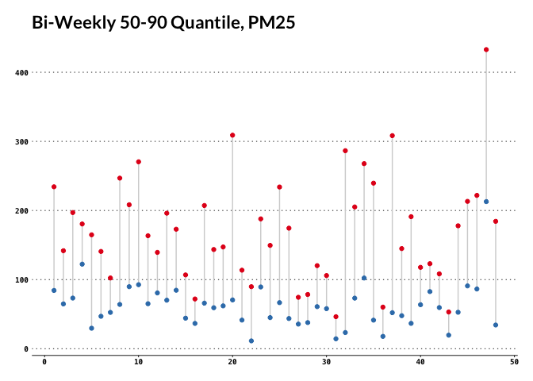
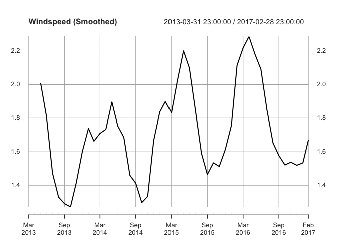

Tutorial on Working Time Series in R
================

``` 
 -- This README.md is generated from README.Rmd. DO NOT edit here. -- 
```

## Background

Though you may not be an econometrician or a quant analyst, dealing with
time series data is common in every analysis line of work. This is a
walkthrough of usual techniques to explore time series data using `R`.

## Setup

The following are the libraries needed for this tutorial. Note that,
there are several time-series objects in `R`, most common ones are `ts`
`xts` and `zoo`. They can be used interchangably most of the time. This
tutorial will rely on `xts` (eXtensible Time Series).

``` r
library(tidyverse)
library(ggfortify)
library(ggthemes)
library(magrittr)
library(janitor)
library(glue)
library(xts)
library(lubridate)
library(quantmod)
library(forecast)
```

## Dataset

We will make use of the air-quality data from the Beijing Municipal
Environmental Monitoring Center. Specifically, the PM25 reading, an
atmospheric particulate matter (PM) that have a diameter of less than
2.5 micrometers.

The comprehensive data set includes hourly air pollutants data from 12
nationally-controlled air-quality monitoring sites. The meteorological
data in each air-quality site are matched with the nearest weather
station from the China Meteorological Administration. The time period is
from March 1st, 2013 to February 28th, 2017. Missing data are denoted as
NA.

Source:
*<https://archive.ics.uci.edu/ml/datasets/Beijing+Multi-Site+Air-Quality+Data>*

Zhang, S., Guo, B., Dong, A., He, J., Xu, Z. and Chen, S.X. (2017)
Cautionary Tales on Air-Quality Improvement in Beijing. Proceedings of
the Royal Society A, Volume 473, No. 2205, Pages 20170457.

``` r
# combine all csv files at once
# convert index to datetime obj
raw <- "Data" %>%
    list.files(full.names = TRUE) %>%
    lapply(., read_csv) %>%
    bind_rows() %>%
    clean_names() %>% 
    mutate(no = glue("{year}-{month}-{day} {hour}:00:00"), 
           no = as.POSIXct(no, tz = "Asia/Shanghai")) %>% 
    select(-c(year:hour)) %>% 
    rename(datetime = no)

# convert to time series
pm25 <- raw %>% 
    group_by(datetime) %>% 
    summarise(value = mean(pm2_5, na.rm = TRUE)) %$% 
    xts(.$value, order.by = .$datetime)
names(pm25) <- "pm25"

head(pm25)
```

    ##                         pm25
    ## 2013-03-01 00:00:00 5.666667
    ## 2013-03-01 01:00:00 6.833333
    ## 2013-03-01 02:00:00 5.666667
    ## 2013-03-01 03:00:00 6.000000
    ## 2013-03-01 04:00:00 4.833333
    ## 2013-03-01 05:00:00 5.500000

## Exploratory

There are 4 ways to deal with missing data, to omit use `na.omit`, to
carry last observation forward use `na.locf`, to carry next observation
backward use `na.locf(fromLast = TRUE)`, to interpolate using linear
approximation use `na.approx`.

``` r
# fill missing values
pm25 <- na.locf(pm25)
```

For plotting, there are several ways. Either using base R default,
through `ggfortify` autoplot method, or simply using `ggplot` as per
usual.

``` r
# very basic
plot(pm25, main = "xts::plot.xts")
```

<!-- -->

``` r
# shortcut for ggplot
autoplot(pm25) + labs(x = "", y = "", title = "ggfortify::autoplot.xts")
```

<!-- -->

``` r
# full customization
pm25 %>% 
    ggplot(aes(Index, pm25)) + 
    geom_line(col = "navyblue") + 
    geom_smooth(se = FALSE, col = "red") + 
    scale_x_datetime(date_breaks = "6 months", date_labels = "%b %y") +
    labs(x = "", y = "", title = "the ggplot2 way") + 
    ggthemes::theme_wsj(title_family = "Times", color = "white", base_size = 7)
```

<!-- -->

## Decompose Series into Periods

Usually we want to break down a long series into periods (weeks, months,
or years) for some calculation. Using `xts` it is simply finding
endpoints and proceed to apply some function periodically. Say, to find
monthly average of PM25.

``` r
# decompose by months or years
ep     <-  endpoints(pm25, on = "months")
monthly_mu <- period.apply(pm25, INDEX = ep, FUN = mean)
indexFormat(monthly_mu) <- "%B %Y"
head(monthly_mu)
```

    ##                  pm25
    ## March 2013  104.71906
    ## April 2013   62.22600
    ## May 2013     81.53193
    ## June 2013   102.14312
    ## July 2013    67.68538
    ## August 2013  60.87607

``` r
# detect peaks
pks <- monthly_mu[quantmod::findPeaks(monthly_mu) - 1]

monthly_mu %>% 
    ggplot(aes(Index, pm25)) + 
    geom_line(col = "dodgerblue", alpha = .7) + 
    geom_point(col = "navyblue") + 
    geom_vline(xintercept = index(pks), lty = 4, col = "salmon")+ 
    labs(title = "PM25 Monthly Average from 2013 to 2017")
```

<!-- -->

In general, follows a `split-apply-combine` strategy. Another example,
say we would like to determine bi-weekly variance by visualizing 50 and
95 quantile.

``` r
# using split-apply-combine strategy
bi_week_range <- pm25 %>% 
    split("month") %>% 
    lapply(function(x) quantile(first(x, "2 weeks"), c(0.5, 0.9))) %>% 
    do.call(rbind, .) %>% 
    as.data.frame() %>% 
    set_names(nm = c("min", "max"))

bi_week_range %>% 
    mutate(week = 1:length(min)) %>% 
    gather(var, val, -week) %>% 
    ggplot(aes(week, val, col = var, group = week)) +
    geom_line(col = "lightgray") +
    geom_point() + 
    scale_color_brewer(guide = "none", palette = "Set1") + 
    labs(title = "Bi-Weekly 50-90 Quantile, PM25")
```

<!-- -->

## Data Transformation

This is merely an exercise to demonstrate how to translate a long format
to wide format without losing time-series property. Note: not a data
frame.

``` r
# specify which @year which @month
get_core <- function(y, m) {
    x = coredata(monthly_mu[year(monthly_mu) == y & month(monthly_mu) == m])
    ifelse(length(x) == 0L, NA, x)
}

# from long to wide
# ** map-map is just shortcut for putting 2 for-loops together
yr = unique(year(monthly_mu))
monthly_wide <- map(1:12, ~ map2_dbl(.x, yr, ~ get_core(..2, ..1))) %>% 
    map(~ ts(., start = min(yr), end = max(yr), frequency = 1)) %>% 
    set_names(month.abb) %>% 
    do.call(cbind, .)

# stil a time series
monthly_wide[, c('Dec', 'Jan', 'Feb')]
```

    ## Time Series:
    ## Start = 2013 
    ## End = 2017 
    ## Frequency = 1 
    ##            Dec       Jan       Feb
    ## 2013  78.33322        NA        NA
    ## 2014  59.51845  97.93781 153.70431
    ## 2015 149.55659  96.29138  93.23196
    ## 2016 128.72614  66.87994  42.83319
    ## 2017        NA 113.95358  68.67326

``` r
monthly_wide %>% 
    autoplot(facets = FALSE) +
    scale_color_brewer(palette = "Paired")
```

<!-- -->

In practice, usually there is no need to do that. To have more control
on plotting, follows tidy data principle (use long format).

``` r
monthly_mu %>% 
    ggplot(aes(
        x   = year(Index),
        y   = pm25,
        col = factor(month(Index))
    )) + 
    geom_line() + 
    facet_wrap(. ~ month(Index, label = TRUE)) + 
    scale_color_brewer(palette = "Paired", guide = "none") + 
    theme_minimal(base_family = "Menlo") + 
    labs(x = "", y = "", title = "PM25 by Month (March 2013 - March 2017)")
```

<!-- -->

## Detect Correlation, Trend and Seasonality

On detecting seasonality, use autocorrelation for a quick scan.
Autocorrelation measures the linear relationship between lagged values
of a time series. We won’t go into details about the math behind. You
can find plenty of those by searching online.

We begin by exploring the correlation between windspeed and pm25 measure
using a scatter plot.

``` r
windspeed <- raw %>% 
    group_by(datetime) %>% 
    summarise(value = mean(wspm, na.rm = TRUE)) %$%
    xts(.$value, order.by = .$datetime)

wspm25 <- merge(pm25, windspeed, join = "left")

# a quick scatter point   
qplot(
    x = windspeed,
    y = pm25,
    data = as.data.frame(wspm25),
    alpha = .1
) +
    geom_smooth(method = "lm", se = FALSE) + 
    scale_alpha_continuous(guide = "none") +
    labs(x = "Windspeed", title = "PM25") + 
    theme_minimal(base_family = "Menlo")
```

<!-- -->

We noticed that the windspeed might have a correlation with pm25. As for
windspeed, it is general known to be seasonal. Is it?

``` r
ep    <- endpoints(wspm25, "months")
wspmu <- wspm25$windspeed %>% 
    period.apply(INDEX = ep, FUN = mean) %>% 
    na.locf()
plot(wspmu, main = "Windspeed")
```

<!-- -->

The plot above does not make it obvious. We can reduce noise by applying
moving average smoothing.

``` r
# moving average to reduce noise
wspmu_smoothed  <- rollapply(wspmu, width = 3, FUN = mean)
# or using forecast package
# wspmu_smoothed <- forecast::ma(wspmu, order = 3)

# detect seasonality using autocorrelation
plot(wspmu_smoothed, main = "Windspeed (Smoothed)")
```

<!-- -->

There you notice the seasonality and upward moving trend.
Autocorrelation `stats::acf` gives us a clearer understanding. When data
have a trend, the autocorrelations for small lags tend to be large and
positive. When data are seasonal, the autocorrelations will be larger
for the seasonal lags (at multiples of the seasonal frequency) than for
other lags. What if a series embeds both trend and seasonality? How do
the autocorrelations look like?

The blue lines incidicates ±2/√T, where T is the length of series,
representing white noise.

``` r
forecast::ggAcf(wspmu) + labs(title = "Correlogram - Windspeed")
```

<!-- -->

## Session Info

    ## R version 3.6.1 (2019-07-05)
    ## Platform: x86_64-apple-darwin15.6.0 (64-bit)
    ## Running under: macOS Mojave 10.14
    ## 
    ## Matrix products: default
    ## BLAS:   /Library/Frameworks/R.framework/Versions/3.6/Resources/lib/libRblas.0.dylib
    ## LAPACK: /Library/Frameworks/R.framework/Versions/3.6/Resources/lib/libRlapack.dylib
    ## 
    ## locale:
    ## [1] en_US.UTF-8/en_US.UTF-8/en_US.UTF-8/C/en_US.UTF-8/en_US.UTF-8
    ## 
    ## attached base packages:
    ## [1] stats     graphics  grDevices utils     datasets  methods   base     
    ## 
    ## other attached packages:
    ##  [1] forecast_8.9    quantmod_0.4-15 TTR_0.23-5      lubridate_1.7.4
    ##  [5] xts_0.11-2      zoo_1.8-6       glue_1.3.1      janitor_1.2.0  
    ##  [9] magrittr_1.5    ggthemes_4.2.0  ggfortify_0.4.8 forcats_0.4.0  
    ## [13] stringr_1.4.0   dplyr_0.8.3     purrr_0.3.3     readr_1.3.1    
    ## [17] tidyr_1.0.0     tibble_2.1.3    ggplot2_3.2.1   tidyverse_1.3.0
    ## 
    ## loaded via a namespace (and not attached):
    ##  [1] tseries_0.10-47    httr_1.4.1         jsonlite_1.6       splines_3.6.1     
    ##  [5] modelr_0.1.5       assertthat_0.2.1   cellranger_1.1.0   yaml_2.2.0        
    ##  [9] pillar_1.4.2       backports_1.1.5    lattice_0.20-38    quadprog_1.5-8    
    ## [13] digest_0.6.23      RColorBrewer_1.1-2 rvest_0.3.5        snakecase_0.11.0  
    ## [17] colorspace_1.4-1   htmltools_0.4.0    Matrix_1.2-17      timeDate_3043.102 
    ## [21] pkgconfig_2.0.3    broom_0.5.2        haven_2.2.0        scales_1.1.0      
    ## [25] mgcv_1.8-28        generics_0.0.2     farver_2.0.1       ellipsis_0.3.0    
    ## [29] withr_2.1.2        urca_1.3-0         nnet_7.3-12        lazyeval_0.2.2    
    ## [33] cli_1.1.0          crayon_1.3.4       readxl_1.3.1       evaluate_0.14     
    ## [37] fs_1.3.1           nlme_3.1-140       xml2_1.2.2         tools_3.6.1       
    ## [41] hms_0.5.2          lifecycle_0.1.0    munsell_0.5.0      reprex_0.3.0      
    ## [45] compiler_3.6.1     rlang_0.4.2        grid_3.6.1         rstudioapi_0.10   
    ## [49] labeling_0.3       rmarkdown_1.17     gtable_0.3.0       fracdiff_1.4-2    
    ## [53] DBI_1.0.0          curl_4.2           R6_2.4.1           gridExtra_2.3     
    ## [57] knitr_1.26         zeallot_0.1.0      stringi_1.4.3      parallel_3.6.1    
    ## [61] Rcpp_1.0.3         vctrs_0.2.0        dbplyr_1.4.2       tidyselect_0.2.5  
    ## [65] xfun_0.11          lmtest_0.9-37
